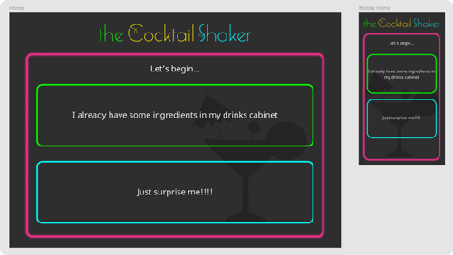

# the Cocktail Shaker

>
> The Cocktail Shaker website is designed to inspire cocktail choices whether someone has ingredients in their drinks cabinet or not.
>

The live site has been deployed via GitHub to https://paulwheatcroft.github.io/theCocktailShaker/

## User Experience (UX)

2 sets of target personas have been identified:

- Someone has some ingredients and wants to be inspired to make a cocktail
- Someone just wants to be inspired by a cocktail choice

### Someone who has some ingredients

As someone who has some ingredients in their drinks cabinet I would like to:
1. Find a cocktail I can make with the ingredients I have available
- The result needs to let me know all the ingredients I need to use
- The result need to show me how to make the cocktail
- The result needs to show me a picture of the cocktail
2. If I'm not inspired by the first choice I would like to find another option using the same ingredients
3. If I like what I find I would like to email the full ingredients list including instructions of how to make the drink to an email address of my choice.
4. If I don't find any drink that inspire me I would like to start again

### Someone who just wants to be surprised and inspired to make a cocktail

As someone who would like to be inspired by a cocktail choice without any prior preconceptions I would like to:
1. Easily find a cocktail without having to make any choices
- The result needs to let me know all the ingredients I need to use
- The result need to show me how to make the cocktail
- The result needs to show me a picture of the cocktail
2. If I'm not inspired by the first choice I would like to find another option using the same ingredient choices
3. If I like what I find I would like to email the full ingredients list including instructions of how to make the drink to an email address of my choice.
4. If I don't find any drink that inspire me I would like to start again

### User Stories

Using the targeted personas, the following list of user stories have been identified to fulfil their needs.

- As a person with some ingredients in my drinks cabinet i can search for a cocktail to make based on a specific search using one or two ingredients
- As a person with some ingredients in my drinks cabinet if i don't want to make the cocktail I see i would like to find another using the same criteria
- As a person with some ingredients in my drinks cabinet if I find a drink I like I would like to find out how to make the cocktail
- As a person with some ingredients in my drinks cabinet if I find a drink I really like I would like to email the instructions to myself
- As a person with some ingredients in my drinks cabinet if i don't find anything I would like to refine my choice and search again
- Someone who just wants to be surprised and inspired to make a cocktail I would like to have a selection of cocktails to look at
- Someone who just wants to be surprised and inspired to make a cocktail if I find a drink I like I would like to find out how to make the cocktail
- Someone who just wants to be surprised and inspired to make a cocktail if I find a drink I really like I would like to email the instructions to myself
- Someone who just wants to be surprised and inspired to make a cocktail if I don't find something that entices me I would like to look at another selection of cocktails

## Design Choices

The website needs to be a fun and engaging mobile first site with a striking colour pallet. And the overal feel was based on a hybrid on the 1920s and the 1980s.

| Description | Hex Colour Value |
| --- | ----------- |
| Dark grey used as primary background colour | #1A1A1A |
| Lighter grey used as secondary background colour | #474747 |
| Off white used for text | #f9f9f9 |
| Pink | #FF3093 |
| Yellow | #FFE500 |
| Green | #05FF00 |
| Blue | #02F4F4 |

There we no suitable fonts for the main logo available on Google Fonts. Marlowe Swirl W05 Regular was purchased through Fonts.com and installed locally. This font was also used for primary headings.

Google Font Noto Sans GP was used as the standard text throught the website.

## Structure

The site was constructed primarily using vanilla JavaScript with a view to using template literals for updating a page as to not require HTML page refreshing when updating content.

Whilst the focus is on a mobile first design the website needs to provide an optimal experience across all screen types.

The site consists of the following HTML pages

1. index.html
2. ingredients.html
3. random.html
4. email.html

The email functionality was achieved by integrating Emailjs to the email.html file

## Wireframing

Mocking up of the site was initially done on pen and paper and then brought to life using Figma. Figma wireframes for the site can be found here https://www.figma.com/file/K1AR2OIITD70scuCkTtzkj/the-Cocktail-Shaker?node-id=0%3A1

During the wireframing process a third persona was removed. This persona didn't have any ingredients but did know which ingredients they wanted to use. The persona had too much crossover with the "Someone who has some ingredients" persona and including it caused the narrative of the appication to become confusing. Therefore the decision was taken to remove the persona. 

[Releases - index.html]

## Design Choices During Development

The navigational elements have evolved through user testing. This included changing icons used and adding a home button.

The wireframe show 3 available inputs for ingredients the persona may have. This was not difficult to build however testing the API showed that 3 ingredients more often than not resulted in no returned cocktails. Therefore a decision was taken to reduce the number of inputs to 2.

## Technologies

### Languages Used

- HTML5
- CSS3
- JavaScript

### Frameworks, Libraries & Programs Used

- [JavaScript](https://www.javascript.com/): Vanilla JavaScript was used throughout the website to provide the interactivity of the site
- [Google Fonts](https://fonts.google.com/): Google fonts were used to import the 'Noto Sans', 'Noto Sans TC' and 'Monoton' font into the style.css file which is used on all pages throughout the project
- [Font Awesome](https://fontawesome.com/): Font Awesome was used on all pages throughout the website for social media icons
- [Emailjs](https://https://www.emailjs.com//): Emailjs provided the functionality to send emails
- [Animate.css](https://animate.style/): Animate.css provide a quick solution for the simple animation that is used on the website
- [Git](https://git-scm.com/): Git was used for version control by utilizing the Gitpod terminal to commit to Git and Push to GitHub
- [Gitpod](https://www.gitpod.io/): Gitpod was used as the development environment
- [GitHub](https://github.com/): GitHub is used to store the projects code after being pushed from Git
- [Photoshop](https://www.adobe.com/uk/products/photoshopfamily.html): Photoshop was used extensively to create artist images including the hero images
- [Inkscape](https://inkscape.org/): Inkscape was used to create SVG files where needed such as the artist's logo
- [Figma](https://www.figma.com/): Figma was used to create the wireframes during the design process

## Testing

### Testing User Stories from User Experience (UX) Section

####	Someone who has some ingredients Visitor Goals 

####	Someone who just wants to be surprised and inspired to make a cocktail Visitor Goals

Both HTML and CSS have been validated via

- W3C [Validation](https://validator.w3.org/nu/)

Accessibility was checked at [www.webaccessibility.com] with 0 violations identified.

Responsiveness was checked throughout using the Google dev tools and [www.responsinator.com]

A code review was posted in the Code Institute peer-code-review channel. Feedback helped shape the UX.

I used a wide group of friends and family to test the user stories across the following operating systems and browsers. The feedback from this group helped shape both the UI and UX.

- Windows (multiple computers)
    - Internet Explorer 11
    - Microsoft Edge
    - Chrome
    - Firefox
    - Opera
- macOS (MacBook Air and iMac)
    - Safari
    - Chrome
- Android (OPPO Reno 2, Nokia 3.2, Huawei P Smart 2019)
    - Native OPPO handset browser
    - Chrome browser
- iOS (iPhone 7, iPhoneX, iPhone SE)
    - Safari

Functional testing was carried out against every element to ensure everything worked and was linked as expected before user tested was started. This was recorded in [functional-testing.xlsx](functional-testing.xlsx). 

## Bugs and issues
The ingredients lists will display the clicked ingredient in the input field that was last clicked. This should only update the specific input the list is associated with.
The getHow function in getIngredients.js, whilst working perfectly fine, needs to be broken down in to smaller functions to simplify future development.

## Deployment

The Project has been deployed via Github Pages. To do this:

1.  Log in to GitHub and locate the GitHub Repository
2.  At the top of the Repository locate the "Settings" Button on the menu.
3.  Scroll down the Settings page until you locate the "GitHub Pages" Section.
4.  Under "Source", click the dropdown called "None" and select "Master Branch". The page will automatically refresh.
5.  Scroll back down through the page to locate the now published site link in the "GitHub Pages" section.

## Acknowledgements

The project was started using the The Code Institute's [Gitpod Full Template](https://github.com/Code-Institute-Org/gitpod-full-template).

The code for the gradient border came from https://codepen.io/alphardex/pen/vYEYGzp

The w3chools website is a goto for all manner of things but specifically this tutorial https://www.w3schools.com/howto/howto_js_filter_lists.asp for creating the filter used on the text input boxes when selecting an ingredient and this https://www.w3schools.com/css/css_tooltip.asp which was used to creat the tooltips.

## Further Development Ideas

