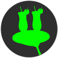
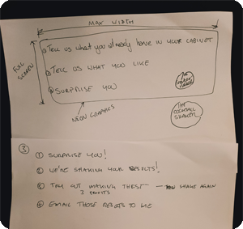
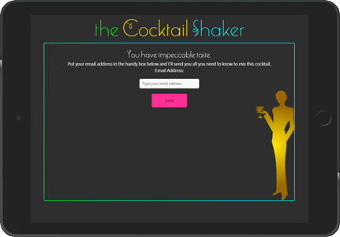
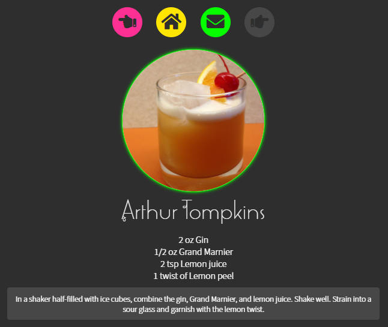
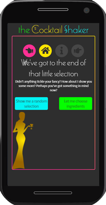
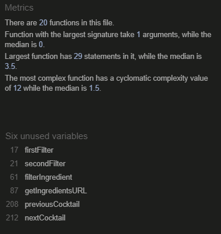
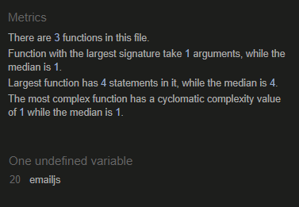
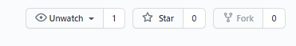

# the Cocktail Shaker

>
> The Cocktail Shaker website is designed to inspire cocktail choices whether someone has ingredients in their drinks cabinet or not.
>

The live site has been deployed via GitHub to https://paulwheatcroft.GitHub.io/theCocktailShaker/

## User Experience (UX)

The customer of this site isn’t someone with a strong opinion of what they want, it’s for people who want to be inspired and surprised.

2 sets of target personas have been identified:

- Someone who has some ingredients and wants to be inspired to make a cocktail
- Someone just wants to be inspired by a cocktail choice

### Someone who has some ingredients

As someone who has some ingredients in their drinks cabinet I would like to:
1. Find a cocktail I can make with the ingredients I have available
    - The results need to let me know all the ingredients I need to use
    - The results need to show me how to make the cocktail
    - The results need to show me a picture of the cocktail
2. If I'm not inspired by the first choice I would like to find another option using the same ingredients
3. If I like what I find I would like to email the full ingredients list including instructions of how to make the drink to an email address of my choice.
4. If I don't find any drinks that inspire me I would like to start again

### Someone who just wants to be surprised and inspired to make a cocktail

As someone who would like to be inspired by a cocktail choice without any prior preconceptions I would like to:
1. Easily find a cocktail without having to make any choices
    - The results need to let me know all the ingredients I need to use
    - The results need to show me how to make the cocktail
    - The results need to show me a picture of the cocktail
2. If I'm not inspired by the first choice I would like to find another option from a selection of choices
3. If I like what I find I would like to email the full ingredients list, including instructions of how to make the drink, to myself.
4. If I don't find any drink that inspire me I would like to start again

### User Stories

Using the targeted personas, the following list of user stories have been identified to fulfil their needs.

- As a person with some ingredients in my drinks cabinet I can search for a cocktail to make based on a specific search using one or two ingredients
- As a person with some ingredients in my drinks cabinet if I don't want to make the cocktail I see first, via an image, I would like to find another using the same criteria
- As a person with some ingredients in my drinks cabinet if I find a drink I like I would like to find out how to make the cocktail
- As a person with some ingredients in my drinks cabinet if I find a drink I really like I would like to email the instructions to myself
- As a person with some ingredients in my drinks cabinet if I don't find anything I would like to refine my choice and search again
- As someone who just wants to be surprised and inspired to make a cocktail I would like to have a selection of cocktails to look at
- As someone who just wants to be surprised and inspired to make a cocktail if I find a drink I like I would like to find out how to make the cocktail
- As someone who just wants to be surprised and inspired to make a cocktail if I find a drink I really like I would like to email the instructions to myself
- As someone who just wants to be surprised and inspired to make a cocktail if I don't find something that entices me I would like to look at another selection of cocktails

## Design Choices

The website needs to be a fun and engaging mobile first site with a striking colour pallet. And the overall feel is based on a hybrid of the 1920s and the 1980s.

Where possible the site should fit on to the screen be that mobile, tablet or desktop.

The UX was designed to be more like an app than a traditional website and that it would take the user through an intuitive journey to finding a cocktail rather than being overly prescriptive with an overwhelming range of options and choices. 

| Description | Hex Colour Value |
| --- | ----------- |
| Dark grey used as primary background colour | #1A1A1A |
| Lighter grey used as secondary background colour | #474747 |
| Off white used for text | #f9f9f9 |
| Pink | #FF3093 |
| Yellow | #FFE500 |
| Green | #05FF00 |
| Blue | #02F4F4 |

There were no suitable fonts for the main logo on Google Fonts. Marlowe Swirl W05 Regular was purchased through Fonts.com and installed locally. This font was also used for primary headings.

Google Font Noto Sans JP was used as the standard text throughout the website.

## Structure

The site was constructed primarily using vanilla JavaScript making use of template literals for updating HTML pages as to not require HTML page refreshing when updating content.

Whilst the focus is on a mobile first design the website needs to provide an optimal experience across all screen types. By keeping the app simple and primarily fitting to a screen size resizing up to tablet and mobile was made simple. Specific iPad media queries were used to ensure the landscape experience was as good as it could be.

The site consists of the following HTML pages

1. index.html
2. ingredients.html
3. random.html
4. email.html
5. 404.html

The email functionality was achieved by integrating Emailjs to the email.html file

## Wireframing

***

Mocking up of the site was initially done on pen and paper and then brought to life using Figma. Figma wireframes for the site can be found here [Wireframes](https://www.figma.com/file/K1AR2OIITD70scuCkTtzkj/the-Cocktail-Shaker?node-id=0%3A1)

During the wireframing process a third persona was removed. This persona didn't have any ingredients but did know which ingredients they wanted to use. However, they had too much crossover with the "Someone who has some ingredients" persona and including it caused the narrative of the application to become confusing. The purpose of the site is to inspire and surprise people rather than for people who already have an idea of what they want. Therefore, the decision was taken to remove the persona. 

## Design Choices During Development

The navigational elements, when progressing through a list of cocktails, evolved following user testing. This included changing icons used and adding a home button. The information button now has a "wiggle" animation to highlight the importance.

Tooltips were added to the navigation buttons, in desktop mode, in response to accessibility concerns. This doesn't work well For tablets and mobiles and is disabled but Aria-Labels are provided for screen readers.

The wireframe shows 3 available inputs for ingredients. This was not difficult to build however testing the API showed that 3 ingredients more often than not resulted in no returned cocktails. Therefore a decision was taken to reduce the number of inputs to 2.

Unfortunately some ingredients don't return a cocktail. This was found during user testing and is a fault with the API. This has been handled through the code and still keeps the user experience coherent. The fix is documented in the code.

## Technologies

### Languages Used

- HTML5
- CSS3
- JavaScript

### Frameworks, Libraries & Programs Used

- [JavaScript](https://www.javascript.com/): Vanilla JavaScript was used throughout the website to provide the interactivity of the site
- [TheCocktailDB API](https://www.thecocktaildb.com/): All of the data provided on the site is retrieved from TheCocktailDB API. I'm a patreon and have access to advanced features
- [Google Fonts](https://fonts.google.com/): Google fonts were used to import the 'Noto Sans JP' afont into the style.css file which is used on all pages throughout the project
- [Font Awesome](https://fontawesome.com/): Font Awesome was used for the navigational buttons
- [Emailjs](https://www.emailjs.com/): Emailjs provided the functionality to send emails
- [Animate.css](https://animate.style/): Animate.css provide a quick solution for the simple animation that is used on the website
- [Git](https://git-scm.com/): Git was used for version control by utilizing the Gitpod terminal to commit to Git and Push to GitHub
- [Gitpod](https://www.gitpod.io/): Gitpod was used as the development environment switching midway to their VSCode integration (they updated their platform)
- [GitHub](https://GitHub.com/): GitHub is used to store the project's code. Extensive use of branching enabled the control of development and easy regression
- [Photoshop](https://www.adobe.com/uk/products/photoshopfamily.html): Adobe Photoshop was used to create images for the README file
- [Illustrator](https://www.adobe.com/uk/products/illustrator.html): Adobe Illustrator was used to amend the website's background graphics
- [Figma](https://www.figma.com/): Figma was used to create the wireframes during the design process

## Testing

### Testing User Stories from User Experience (UX) Section

>
> Someone with some ingredients Visitor Goals
>

- As a person with some ingredients in my drinks cabinet I can search for a cocktail to make based on a specific search using one or two ingredients.
    1. Upon loading the website the user is greeted by a fun an minimal interface. The intentions  of the site are explained. Users are also presented with two options. One of which is "I've got some ingredients".
    2. After clicking this button the user is presented with the option to enter one or two ingredients and search for cocktails containing these ingredients using the "Shake it for me" button.
    3. Once the search is complete the user is either presented with a selection of cocktails to navigate through using the "next cocktail" and "previous cocktail" buttons, or if no cocktails are returned, the option to search again using just one or other of the ingredients.

- As a person with some ingredients in my drinks cabinet if I don't want to make the cocktail I see I would like to find another using the same criteria.
    1. Once the user is presented with their cocktail selection they can navigate through the available cocktails using the Next Cocktail navigation button. All the cocktails returned with contain the ingredient(s) selected.

- As a person with some ingredients in my drinks cabinet if I find a drink I like I would like to find out how to make the cocktail.
    1. If the user see a drink they like whilst navigating through the returned selection they can click on the "instructions" button that contains the tooltip "Show Instructions" in the top navigation section to view the cocktail's instructions.

- As a person with some ingredients in my drinks cabinet if I find a drink I really like I would like to email the instructions to myself.
    1. If the user really likes their selected cocktail following looking at the instructions they can use the "email" button to initiate sending the instructions to their email address.
    2. The user is then presented with an input box to enter their email address. They can then click on the send button to send the instruction to their email address.

- As a person with some ingredients in my drinks cabinet if i don't find anything I would like to refine my choice and search again.
    1. If the user doesn't find anything with their search criteria they will reach the end of the selection and then be presented with the option to either search again with a different selection of ingredients or to search for a random selection of cocktail.
    2. At any time the user can click on the "home" button in the navigation section to take them back to the start point of the website.

>
> Someone Who Just wants to be Surprised and Inspired to Make a Cocktail Visitor Goals
>

- Someone who just wants to be surprised and inspired to make a cocktail I would like to have a selection of cocktails to look at.
    1. Upon loading the website the user is greeted by a fun an minimal interface. The itentions  of the site are explained. Users are also presented with two options. One of which is "surprise me with something".
    2. Once the search is complete the user is presented with a random selection of 10 cocktails to navigate through using the "next cocktail" and "previous cocktail" buttons.

- Someone who just wants to be surprised and inspired to make a cocktail if I find a drink I like I would like to find out how to make the cocktail.
    1. If the user see a drink they like whilst navigating through the returned selection they can click on the "instructions" button that, when in desktop view, contains the tooltip "Show Instructions" in the top navigation section to view the cocktail's instructions.

- Someone who just wants to be surprised and inspired to make a cocktail if I find a drink I really like I would like to email the instructions to myself.
    1. If the user really likes their selected cocktail following looking at the instructions they can use the "email" button to initiate sending the instructions to their email address.
    2. The user is then presented with an input box to enter their email address. They can then click on the send button to send the instruction to their email address.

- Someone who just wants to be surprised and inspired to make a cocktail if I don't find something that entices me I would like to look at another selection of cocktails.
    1. If the user doesn't find anything with their search criteria they will reach the end of the selection and then be presented with the option to either search again for some more random cocktail or to search using specific ingredients.
    2. At any time the user can click on the "home" button in the navigation section to take them back to the start point of the website.

Both HTML and CSS have been validated via

- W3C [Validation](https://validator.w3.org/nu/)
    - [index.html](https://validator.w3.org/nu/?doc=https%3A%2F%2Fpaulwheatcroft.github.io%2FtheCocktailShaker%2F)
    - [ingredients.html](https://validator.w3.org/nu/?doc=https%3A%2F%2Fpaulwheatcroft.github.io%2FtheCocktailShaker%2Fingredients.html)
    - [random.html](https://validator.w3.org/nu/?doc=https%3A%2F%2Fpaulwheatcroft.github.io%2FtheCocktailShaker%2Frandom.html)
    - [email.html](https://validator.w3.org/nu/?doc=https%3A%2F%2Fpaulwheatcroft.github.io%2FtheCocktailShaker%2Femail.html)
    - [style.css](https://jigsaw.w3.org/css-validator/validator?uri=https%3A%2F%2Fpaulwheatcroft.github.io%2FtheCocktailShaker%2Fcss%2Fstyle.css&profile=css3svg&usermedium=all&warning=1&vextwarning=&lang=en)
    - [test.html](https://validator.w3.org/nu/?doc=https%3A%2F%2Fpaulwheatcroft.github.io%2FtheCocktailShaker%2Ftest.html) The HTML generated by the JavaScript files has also been validated by copying and pasting in to a test.html file. The link is as an example for one such code snippet.

  

Both JavaScript files (getIngredients.js and email.js) have been validated with [JSHint](https://jshint.com/) with no errors or warnings. Undefined variables have been validated as either called from HTML files or are from the external framework Emailjs.

Accessibility was checked at [www.webaccessibility.com](https://www.webaccessibility.com/results/?url=https%3A%2F%2Fpaulwheatcroft.github.io%2FtheCocktailShaker%2F). The HTML generated by the JavaScript files has also been validated by copying and pasting in to a test.html file. Any accepted violations have been considered in context. Such as "Ensure ARIA regions, landmarks and HTML sections are identifiable" where buttons are disabled and are greyed out or "meaningful within context" for the email button as this uses a standard email icon which is a common, well used and identifiable icon, with span text of "Send Email" which is able to be read by screen readers and appears as a tooltip on the desktop version.

Responsiveness was checked throughout using the Google dev tools and [www.responsinator.com](http://www.responsinator.com/?url=https%3A%2F%2Fpaulwheatcroft.github.io%2FtheCocktailShaker%2F)

A code review was posted in the Code Institute peer-code-review channel. The fedback was positive and also helped shape the UX with some good suggestions regarding usibility and text changes.

I used a wide group of friends and family to test the user stories across the following operating systems and browsers. The feedback from this group helped shape both the UI and UX as outlined in the Design Choices During Development section.

- Windows (multiple computers)
    - Internet Explorer 11
    - Microsoft Edge
    - Chrome
    - Firefox
    - Opera
- macOS (MacBook Air and iMac)
    - Safari
    - Chrome
- Android (OPPO Reno 2, Nokia 3.2, Huawei P Smart 2019)
    - Native OPPO handset browser
    - Chrome browser
    - Mobile Edge browser
- iOS (iPhone 7, iPhoneX, iPhone SE)
    - Safari

Functional testing has been carried out throughout the build process, usually after major updates, against every element to ensure everything worked and was linked as expected. This is recorded in [functional-testing-theCocktailShaker.xlsx](functional-testing.xlsx). 

## Oustanding Bugs and issues
- Some ingredients don't return any cocktails. I've had to engineer catching this issue to ensure it is handled well.
- The getHow function in getIngredients.js, whilst working perfectly fine, needs to be broken down in to smaller functions to simplify future development. At the moment is it too large.
- The email sent has not yet been formatted well.

## Deployment

The Project has been deployed via GitHub Pages. To do this:

1.  Log in to GitHub and locate the GitHub Repository https://github.com/PaulWheatcroft/theCocktailShaker
2.  At the top of the Repository locate the "Settings" Button on the menu.
3.  Scroll down the Settings page until you locate the "GitHub Pages" Section.
4.  Under "Source", click the dropdown called "None" and select "Master Branch". The page will automatically refresh.
5.  Scroll back down through the page to locate the now published site link in the "GitHub Pages" section.

The site requires full paid access to TheCocktailDB. No instation is required but without the paid version the ingredient list is limited to 100 entries and multiple ingredient searches are not possible.

Emailjs was used for the email functionality. This functionality is privded via their CDN link. The emailjs.sendForm function requires the account and template settings to be configured. Full documentation on the service can be found [HERE](https://www.emailjs.com/docs/) 

Be my guest to fork away at this project. To do this:
1.  Log in to GitHub and locate the GitHub Repository https://github.com/PaulWheatcroft/theCocktailShaker
2.  At the top of the Repository on the far righthand side locate the fork icon and click on it

 

## Acknowledgements

The project was started using the Code Institute's [Gitpod Full Template](https://GitHub.com/Code-Institute-Org/gitpod-full-template).

The code for the gradient border came from [alphardex](https://codepen.io/alphardex) https://codepen.io/alphardex/pen/vYEYGzp

The w3chools website is a go to for all manner of things but was specifically useful for this tutorial https://www.w3schools.com/howto/howto_js_filter_lists.asp for creating the filter used on the text input boxes when selecting an ingredient and this https://www.w3schools.com/css/css_tooltip.asp which was used to create the tooltips.

Thanks to CSS-Tricks for their media query guide [media-queries-for-standard-devices](https://css-tricks.com/snippets/css/media-queries-for-standard-devices/)

The background graphics were modified from [FreeVectors.com](https://www.freevector.com/girls-with-drinks)

The https://www.markdownguide.org/cheat-sheet/ was referenced throughout the lifecycle of the project when updating the README file.

## Further Development Ideas
- Social media sharing of cocktail instructions and images of cocktails made
- Swiping through cocktails on mobile devices
- Ability show non-alcoholic ingredients and cocktails
- Ability to tick all the ingredients you have in the instruction and then create a shopping list for the ingredients you don't
- The format of the email is poor and needs to be structured properly
- Hook up ingredients to a shopping API
- User account environment that allowed for sharing ratings on the cocktails
- User account environment that allowed for adding new cocktails to the database
- Convert measures in to metric
